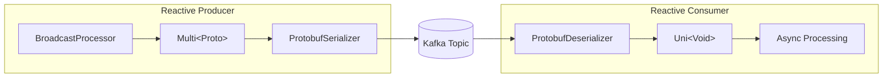
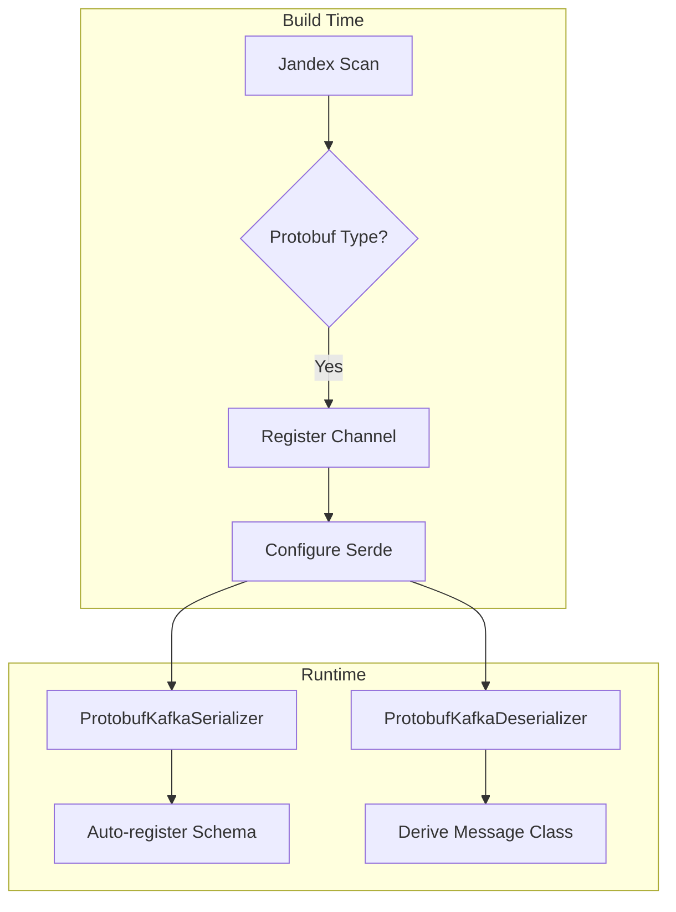

# Quarkus Apicurio Registry Protobuf Extension

A Quarkus extension for seamless Protobuf serialization with Kafka and [Apicurio Registry](https://www.apicur.io/registry/) v3.

This extension **auto-detects Protobuf message types** in your Kafka channels and automatically configures the correct serializers/deserializers - no manual configuration required.

## Features

- **Zero-config serialization** - Automatically configures `ProtobufKafkaSerializer` and `ProtobufKafkaDeserializer`
- **UUID keys enforced** - All messages use UUID keys via `UUIDSerializer`/`UUIDDeserializer`
- **Schema registry integration** - Auto-registers schemas and derives message classes
- **DevServices** - Apicurio Registry starts automatically in dev/test mode
- **Type-safe messaging** - Full Protobuf type support with generated Java classes
- **Mutiny support** - Works with reactive `Multi<T>` and `Uni<Void>` patterns
- **Native image support** - Works with GraalVM native compilation

## Architecture

```mermaid
flowchart LR
    subgraph Producer Service
        P[Java App] --> E[Emitter&lt;Proto&gt;]
        E --> S[ProtobufSerializer]
    end

    S --> K[(Kafka Topic)]
    S -.->|register schema| R[(Apicurio Registry)]

    subgraph Consumer Service
        D[ProtobufDeserializer] --> C[@Incoming]
        C --> A[Java App]
    end

    K --> D
    R -.->|fetch schema| D
```

## Quick Start (Imperative Style)

This section demonstrates the standard imperative approach using `Emitter` and void consumer methods.

### 1. Add the dependency

```gradle
implementation 'io.quarkus:quarkus-apicurio-registry-protobuf:0.0.1-SNAPSHOT'
```

### 2. Define your Protobuf message

Create `src/main/proto/order.proto`:

```protobuf
syntax = "proto3";
package com.example.orders;

option java_package = "com.example.orders.proto";    // (1) Generated Java package
option java_outer_classname = "OrderProtos";         // (2) Wrapper class name

message OrderEvent {
  string order_id = 1;                               // (3) Unique order identifier
  string customer_id = 2;
  double amount = 3;
  int64 timestamp = 4;                               // (4) Unix timestamp in millis
  map<string, string> metadata = 5;                  // (5) Extensible key-value pairs
}
```

1. **java_package** - Controls where generated Java classes are placed
2. **java_outer_classname** - The outer class that contains all message classes
3. **Field numbers** - Protobuf uses numbers (not names) for wire format; never reuse deleted field numbers
4. **int64 for timestamps** - Use `int64` for epoch milliseconds; Protobuf has no native timestamp type
5. **map type** - Native Protobuf map support for flexible metadata without schema changes

### 3. Create a producer

```java
@ApplicationScoped                                   // (1) CDI bean scope
public class OrderProducer {

    @Inject                                          // (2) CDI injection
    @Channel("orders-out")                           // (3) Channel name - links to config
    Emitter<OrderEvent> emitter;                     // (4) Type-safe emitter for Protobuf

    public void sendOrder(String customerId, double amount) {
        OrderEvent order = OrderEvent.newBuilder()   // (5) Protobuf builder pattern
                .setOrderId(UUID.randomUUID().toString())
                .setCustomerId(customerId)
                .setAmount(amount)
                .setTimestamp(System.currentTimeMillis())
                .putMetadata("source", "order-service")
                .build();                            // (6) Immutable message created

        emitter.send(order);                         // (7) Send to Kafka
    }
}
```

1. **@ApplicationScoped** - Single instance shared across the application
2. **@Inject** - CDI injects the emitter at runtime
3. **@Channel** - Binds to `mp.messaging.outgoing.orders-out.*` properties
4. **Emitter&lt;OrderEvent&gt;** - Extension detects `OrderEvent extends MessageLite` and auto-configures serializer
5. **newBuilder()** - Protobuf messages are immutable; use builder to construct
6. **build()** - Validates required fields and creates immutable instance
7. **send()** - Asynchronously sends to Kafka; message is serialized via `ProtobufKafkaSerializer`

### 4. Create a consumer

```java
@ApplicationScoped
public class OrderConsumer {

    private static final Logger LOG = LoggerFactory.getLogger(OrderConsumer.class);

    @Incoming("orders-in")                           // (1) Channel name - links to config
    public void processOrder(OrderEvent order) {    // (2) Protobuf type auto-detected
        LOG.info("Received order: {} for customer {} - ${}",
                order.getOrderId(),                  // (3) Type-safe getter
                order.getCustomerId(),
                order.getAmount());
    }
}
```

1. **@Incoming** - Binds to `mp.messaging.incoming.orders-in.*` properties
2. **OrderEvent parameter** - Extension detects Protobuf type and configures `ProtobufKafkaDeserializer`
3. **Type-safe getters** - Generated code provides null-safe accessors; no casting required

### 5. Configure application.properties

```properties
# Kafka connector (required for DevServices to detect channels)
mp.messaging.outgoing.orders-out.connector=smallrye-kafka   # (1)
mp.messaging.incoming.orders-in.connector=smallrye-kafka

# Topic configuration
mp.messaging.outgoing.orders-out.topic=orders               # (2)
mp.messaging.incoming.orders-in.topic=orders                # (3)
```

1. **connector** - Required; tells Quarkus this channel uses Kafka (enables DevServices)
2. **topic (outgoing)** - Kafka topic name; if omitted, defaults to channel name (`orders-out`)
3. **topic (incoming)** - Must match producer's topic to receive messages

### 6. Run it!

```bash
./gradlew quarkusDev
```

DevServices automatically starts Kafka and Apicurio Registry. That's it!

---

## Reactive Style with Mutiny

For reactive applications, the extension fully supports Mutiny's `Multi` and `Uni` types. This enables backpressure-aware streaming and non-blocking consumers.



### Mutiny Producer

```java
@ApplicationScoped
public class OrderStreamProducer {

    private final BroadcastProcessor<OrderEvent> processor =
            BroadcastProcessor.create();             // (1) Hot stream source

    @Outgoing("orders-stream")                       // (2) Reactive outgoing channel
    public Multi<OrderEvent> produceOrders() {      // (3) Returns reactive stream
        return processor;                            // (4) Emits when items pushed
    }

    public void send(OrderEvent order) {
        processor.onNext(order);                     // (5) Push to stream
    }

    public void complete() {
        processor.onComplete();                      // (6) Signal end of stream
    }
}
```

1. **BroadcastProcessor** - Hot stream that multicasts items to all subscribers; items pushed via `onNext()`
2. **@Outgoing** - Method return type is the message stream (not `void` like imperative style)
3. **Multi&lt;OrderEvent&gt;** - Extension detects Protobuf in generic type and configures serializer
4. **return processor** - SmallRye subscribes to this Multi and sends each item to Kafka
5. **onNext()** - Push items into the stream; they flow through to Kafka asynchronously
6. **onComplete()** - Signals no more items; use for graceful shutdown

### Mutiny Consumer

```java
@ApplicationScoped
public class OrderStreamConsumer {

    private static final Logger LOG = LoggerFactory.getLogger(OrderStreamConsumer.class);

    private final List<OrderEvent> received = new CopyOnWriteArrayList<>();

    @Incoming("orders-stream-in")                    // (1) Reactive incoming channel
    public Uni<Void> processOrder(OrderEvent order) { // (2) Async acknowledgment
        return Uni.createFrom().item(order)          // (3) Wrap in Uni for composition
                .invoke(o -> {                       // (4) Side-effect processing
                    LOG.info("Processing order: {}", o.getOrderId());
                    received.add(o);
                })
                .replaceWithVoid();                  // (5) Signal completion
    }

    public List<OrderEvent> getReceived() {
        return received;
    }
}
```

1. **@Incoming** - Same as imperative, but method signature differs
2. **Uni&lt;Void&gt; return** - Enables async processing; message acked when Uni completes
3. **Uni.createFrom().item()** - Wraps the message in a reactive pipeline
4. **invoke()** - Performs side effects (logging, storing) without transforming the item
5. **replaceWithVoid()** - Discards the item and signals successful processing; triggers Kafka offset commit

### Mutiny Configuration

```properties
# Reactive channels
mp.messaging.outgoing.orders-stream.connector=smallrye-kafka
mp.messaging.incoming.orders-stream-in.connector=smallrye-kafka
mp.messaging.outgoing.orders-stream.topic=orders-reactive      # (1)
mp.messaging.incoming.orders-stream-in.topic=orders-reactive   # (2)
```

1. **Outgoing topic** - Both channels must use the same topic name
2. **Incoming topic** - Matches outgoing to receive the same messages

### When to Use Mutiny vs Imperative

| Pattern | Use When |
|---------|----------|
| **Emitter (imperative)** | Request-response flows, sending from REST endpoints, simple fire-and-forget |
| **Multi (reactive producer)** | Streaming data sources, event sourcing, continuous data feeds |
| **void return (imperative consumer)** | Simple processing, blocking operations acceptable |
| **Uni return (reactive consumer)** | Async processing, non-blocking I/O, backpressure control |

---

## UUID Keys (Enforced)

This extension enforces **UUID keys** for all Kafka messages. String keys are not supported - this is an opinionated design choice that ensures:

- **Idempotency** - Deterministic keys enable replay without duplicates
- **Partitioning** - Consistent key-based routing to partitions
- **Compaction** - Meaningful log compaction with unique identifiers

### Key Extractor Pattern

Implement `UuidKeyExtractor<T>` to define how UUIDs are derived from your messages:

```java
@ApplicationScoped
public class OrderEventKeyExtractor implements UuidKeyExtractor<OrderEvent> {

    @Override
    public UUID extractKey(OrderEvent message) {           // (1) Extract from message
        return UUID.fromString(message.getOrderId());      // (2) Parse UUID from field
    }
}
```

1. **extractKey()** - Called for each message to derive its partition key
2. **UUID.fromString()** - Parse from string field; could also use UUIDv5 for deterministic generation

### Sending with UUID Keys

Use the `ProtobufKafkaHelper` CDI service to send messages with UUID keys:

```java
@ApplicationScoped
public class OrderService {

    @Inject
    @Channel("orders-out")
    Emitter<OrderEvent> emitter;                          // (1) Standard SmallRye emitter

    @Inject
    ProtobufKafkaHelper kafka;                            // (2) CDI service for UUID keys

    @Inject
    OrderEventKeyExtractor keyExtractor;                  // (3) Your key extractor

    // Option 1: Explicit UUID key
    public void sendWithExplicitKey(UUID orderId, OrderEvent order) {
        kafka.send(emitter, orderId, order);              // (4) Pass UUID directly
    }

    // Option 2: Extract key from message
    public void sendWithExtractor(OrderEvent order) {
        kafka.send(emitter, order, keyExtractor);         // (5) Use extractor
    }

    // Option 3: Inline lambda
    public void sendWithLambda(OrderEvent order) {
        kafka.send(emitter, order,
                o -> UUID.fromString(o.getOrderId()));    // (6) One-off extraction
    }
}
```

1. **@Channel emitter** - Standard SmallRye emitter, unchanged
2. **ProtobufKafkaHelper** - Injected service that handles UUID key metadata
3. **Key extractor** - Your implementation, injected for reuse
4. **Explicit UUID** - Use when UUID comes from external source (database, request)
5. **With extractor** - Consistent key derivation across your service
6. **Inline lambda** - Quick one-off cases

### Consuming with UUID Key Access

Access the UUID key via Kafka metadata:

```java
@ApplicationScoped
public class OrderProcessor {

    @Incoming("orders-in")
    public CompletionStage<Void> process(Message<OrderEvent> message) {
        OrderEvent order = message.getPayload();          // (1) Get Protobuf payload

        // Access UUID key from Kafka metadata
        IncomingKafkaRecordMetadata<UUID, OrderEvent> meta =
                message.getMetadata(IncomingKafkaRecordMetadata.class)
                        .orElse(null);                    // (2) Get Kafka metadata

        if (meta != null) {
            UUID key = meta.getKey();                     // (3) Extract UUID key
            LOG.info("Processing order: key={}, id={}",
                    key, order.getOrderId());
        }

        return message.ack();                             // (4) Acknowledge
    }
}
```

1. **getPayload()** - Extracts the deserialized Protobuf message
2. **getMetadata()** - Access Kafka-specific metadata including key, partition, offset
3. **getKey()** - Returns the UUID key (auto-deserialized via `UUIDDeserializer`)
4. **ack()** - Acknowledge successful processing

### RandomUuidKeyExtractor (Testing Only)

For testing or prototyping, a `RandomUuidKeyExtractor` is provided - but it logs a warning:

```java
// DO NOT USE IN PRODUCTION
@Inject
RandomUuidKeyExtractor<OrderEvent> randomExtractor;

kafka.send(emitter, order, randomExtractor);
// Logs: "RandomUuidKeyExtractor is being used! DO NOT USE IN PRODUCTION"
```

Random UUIDs break idempotency and replay. Always implement a proper `UuidKeyExtractor` for production.

---

## How It Works



At **build time**, the extension:
1. Scans your code for `@Incoming`, `@Outgoing`, and `@Channel` annotations
2. Detects if the message type extends `com.google.protobuf.MessageLite`
3. Automatically configures the Protobuf serializer/deserializer for those channels

At **runtime**, the extension:
1. Uses `ProtobufKafkaSerializer` to serialize outgoing messages
2. Auto-registers the Protobuf schema with Apicurio Registry
3. Uses `ProtobufKafkaDeserializer` to deserialize incoming messages
4. Derives the correct Java class from the schema registry

## Configuration Reference

### Auto-configured Properties

The extension automatically sets these properties for detected Protobuf channels:

| Property | Outgoing | Incoming | Description |
|----------|:--------:|:--------:|-------------|
| `key.serializer` | ✓ | | `UUIDSerializer` - enforces UUID keys |
| `key.deserializer` | | ✓ | `UUIDDeserializer` - deserializes UUID keys |
| `value.serializer` | ✓ | | `ProtobufKafkaSerializer` |
| `value.deserializer` | | ✓ | `ProtobufKafkaDeserializer` |
| `auto.offset.reset` | | ✓ | `earliest` |
| `apicurio.protobuf.derive.class` | | ✓ | `true` - derive Java class from registry |
| `apicurio.registry.auto-register` | ✓ | ✓ | `true` - auto-register schemas |
| `apicurio.registry.artifact-resolver-strategy` | ✓ | ✓ | `SimpleTopicIdStrategy` |
| `apicurio.registry.find-latest` | ✓ | ✓ | `true` - use latest schema version |

### Overriding Defaults

All properties can be overridden in `application.properties`:

```properties
# Use a different serializer for a specific channel
mp.messaging.outgoing.orders-out.value.serializer=my.custom.Serializer

# Disable auto-registration for a channel
mp.messaging.outgoing.orders-out.apicurio.registry.auto-register=false

# Use a different artifact strategy
mp.messaging.connector.smallrye-kafka.apicurio.registry.artifact-resolver-strategy=io.apicurio.registry.serde.strategy.TopicIdStrategy
```

### DevServices Configuration

| Property | Default | Description |
|----------|---------|-------------|
| `quarkus.apicurio-registry.protobuf.devservices.enabled` | `true` | Enable/disable DevServices |
| `quarkus.apicurio-registry.protobuf.devservices.image-name` | `apicurio/apicurio-registry:3.1.4` | Container image |
| `quarkus.apicurio-registry.protobuf.devservices.port` | Random | Fixed port (optional) |

## Running in Production

When running outside dev/test mode, you need to provide Kafka and Apicurio Registry:

### Using Docker Compose

```yaml
services:
  kafka:
    image: quay.io/strimzi/kafka:latest-kafka-3.6.0
    command:
      - "sh"
      - "-c"
      - "./bin/kafka-storage.sh format --standalone -t $$(./bin/kafka-storage.sh random-uuid) -c ./config/server.properties && ./bin/kafka-server-start.sh ./config/server.properties"
    ports:
      - "9092:9092"
    environment:
      LOG_DIR: "/tmp/logs"

  apicurio-registry:
    image: apicurio/apicurio-registry:3.1.4
    ports:
      - "8081:8080"
    environment:
      QUARKUS_PROFILE: prod
```

### Production Configuration

```properties
# application.properties
%prod.kafka.bootstrap.servers=kafka:9092
%prod.mp.messaging.connector.smallrye-kafka.apicurio.registry.url=http://apicurio-registry:8080/apis/registry/v3
```

Or via environment variables:

```bash
export KAFKA_BOOTSTRAP_SERVERS=kafka:9092
export MP_MESSAGING_CONNECTOR_SMALLRYE_KAFKA_APICURIO_REGISTRY_URL=http://apicurio-registry:8080/apis/registry/v3
```

## Multiple Topics Example

```properties
# Order events
mp.messaging.outgoing.orders-out.connector=smallrye-kafka
mp.messaging.outgoing.orders-out.topic=orders
mp.messaging.incoming.orders-in.connector=smallrye-kafka
mp.messaging.incoming.orders-in.topic=orders

# Inventory events (different Protobuf type auto-detected)
mp.messaging.outgoing.inventory-out.connector=smallrye-kafka
mp.messaging.outgoing.inventory-out.topic=inventory
mp.messaging.incoming.inventory-in.connector=smallrye-kafka
mp.messaging.incoming.inventory-in.topic=inventory

# Payment events
mp.messaging.outgoing.payments-out.connector=smallrye-kafka
mp.messaging.outgoing.payments-out.topic=payments
```

## Troubleshooting

### Schema not found

If you see `Schema not found` errors, ensure:
1. `apicurio.registry.auto-register=true` is set (default)
2. The producer has sent at least one message to register the schema
3. The registry URL is correct

### Wrong message type

If deserialization returns the wrong type:
1. Verify `apicurio.protobuf.derive.class=true` is set (default)
2. Check that your Protobuf class is on the classpath
3. Ensure the schema in the registry matches your Java class

### DevServices not starting

If Kafka or Registry containers don't start:
1. Verify Docker is running
2. Check `quarkus.apicurio-registry.protobuf.devservices.enabled=true`
3. Ensure `connector=smallrye-kafka` is set for your channels

### Mutiny stream not emitting

If your `Multi` producer isn't sending messages:
1. Verify the `@Outgoing` method is being called (add logging)
2. Check that `BroadcastProcessor.onNext()` is called after subscription
3. Ensure the channel is properly wired in `application.properties`

## Requirements

- Quarkus 3.x
- Java 17+
- Docker (for DevServices in dev/test mode)

## License

MIT License
